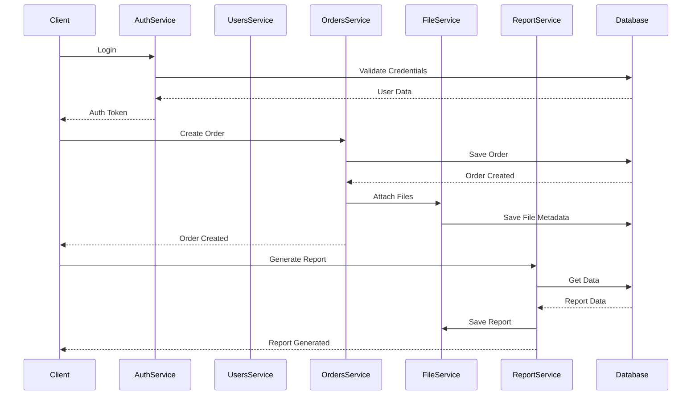
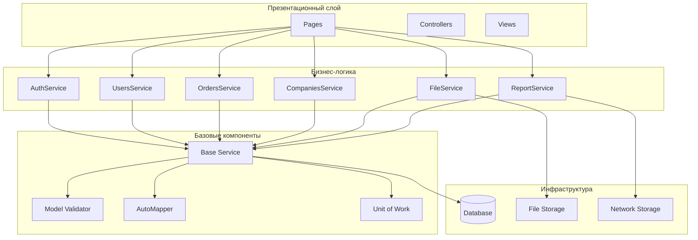
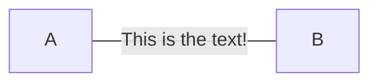

# Серверная часть

## Структура проекта

Проект организован по принципу чистой архитектуры с четким разделением ответственности:

📁 **Mdz.AspNetCore/**  
├── 📁 Binders        → Кастомные биндеры для модели  
├── 📁 Extensions     → Расширения для ASP.NET Core  
├── 📁 Infrastructure → Инфраструктурный код (базы, кеши)  
├── 📁 Middlewares    → Промежуточное ПО (pipeline)  
├── 📁 Pages          → Razor Pages (UI-слой)  
├── 📁 Security       → Безопасность, авторизация, политики  
├── 📁 Services       → Сервисы с бизнес-логикой  
└── 📁 Settings       → Конфигурации (appsettings, env)  

## Авторизация





## Паттерны проектирования


1. Unit of work

```csharp
public class UowMiddleware : IMiddleware
{
    public async Task InvokeAsync(HttpContext context, RequestDelegate next)
    {
        using (var uow = _manager.Begin(new UnitOfWorkOptions
        {
            IsTransactional = shouldEnterTransaction
        }))
        {
            try
            {
                await next(context);
                await uow.Commit();
            }
            catch (Exception)
            {
                await uow.Rollback();
                throw;
            }
        }
    }
}

```


2. Repository

```csharp
public abstract class Service
{
    protected MdlzContext DataContext => _dbContextLazy.Value;
    
    protected Service(IServiceProvider serviceProvider)
    {
        _dbContextProvider = serviceProvider.GetLazyDependency<IDbContextProvider<MdlzContext>>();
        _dbContextLazy = new Lazy<MdlzContext>(() => _dbContextProvider.Service.GetDbContext());
    }
}
```

3. Dependency Injection


```csharp
public static void AddMdz(this IServiceCollection services, IConfiguration configuration)
{
    services.AddMdzCore();
    services.AddAssemblyOf<IModel>();
    services.AddValidatorsFromAssembly(typeof(IModel).Assembly);
    services.AddDataServices(configuration["DatabaseSettings:ConnectionString"]);
    // ... другие сервисы
}
```

## Базовые классы 




